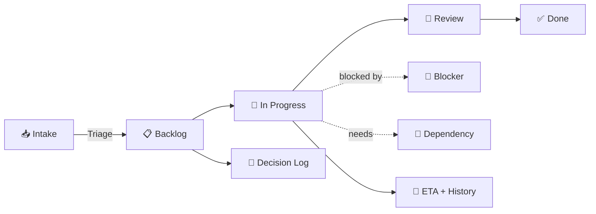

<div align="center">

# 🚀 PE-OS — Taski

### The Product & Project Execution Operating System

**One team. One source of truth. Zero spreadsheets.**

[](https://nestjs.com/)
[](https://react.dev/)
[](https://www.typescriptlang.org/)
[](https://www.prisma.io/)
[](https://www.sqlite.org/)

[]()
[]()
[]()

</div>

---

## ✨ What is this?

**PE-OS** is not another generic task tracker. It's a purpose-built execution system for a small, high-velocity team — designed around three ideas most tools get wrong:

| ❌ The old way | ✅ The PE-OS way |
|---|---|
| Nobody actually knows what's in progress right now | A single live list of active work, with a clear owner |
| New work sneaks in and silently pushes everything back | Work can't enter execution without passing **Intake** |
| Dates get announced, then quietly slip with no trace | Every ETA change is **logged with a mandatory reason** — no silent overwrites |
| Decisions get made and forgotten | A permanent, searchable **Decision Log** |
| Support work eats the team's capacity invisibly | Work is split into 4 visible **Streams**, tracked against real capacity |

> 🎯 **Goal:** the weekly leadership review runs entirely off what's *in* the system — no spreadsheets, no "let me check and get back to you."

---

## 🧠 Core Concepts



- **Two independent axes per work item** — execution stage *and* delivery health — so "in progress" and "at risk" are never conflated.
- **Mandatory Intake** — no task skips the front door.
- **ETA with confidence + assumptions**, never a bare guess, always versioned.
- **Board, My Work, and Weekly Review** — three lenses on the same underlying truth.

---

## 🏗️ Architecture

Deliberately boring, deliberately simple. **One deployable, one database, zero moving parts to babysit.**

```
┌─────────────────────────────────────────────┐
│                   Browser                    │
└───────────────────────┬───────────────────────┘
                         │  one URL
┌───────────────────────▼───────────────────────┐
│              NestJS Runtime (single)           │
│                                                 │
│   /api/v1/*   →  REST API                      │
│   /*          →  React (Vite) build             │
│   SQLite      →  data/app.db                    │
│   Files       →  data/uploads/                  │
└─────────────────────────────────────────────────┘
```

**Explicitly out of scope for the MVP:** managed Postgres, Redis, message queues, S3, SMTP, OAuth/SSO, Kubernetes, microservices, horizontal scaling. This is a **local-first, self-contained** system by design — not an accident.

---

## 🛠️ Tech Stack

<table>
<tr>
<td valign="top" width="50%">

### Backend
- **NestJS** + TypeScript
- **Prisma** ORM (SQLite provider)
- **Zod** for runtime validation
- **JWT** auth with cookie-based refresh
- **Vitest** + Supertest for testing

</td>
<td valign="top" width="50%">

### Frontend
- **React 18** + **Vite**
- **Ant Design v5** (component system)
- **Tailwind** (layout utilities only)
- **dnd-kit** for the drag-and-drop board
- **dayjs + jalaliday** — full Jalali/Shamsi calendar support
- Fully **Persian, RTL-native** UI

</td>
</tr>
</table>

---

## 🚀 Quick Start

```bash
# 1. Clone & configure
git clone https://github.com/pourebadi/Taski.git
cd Taski
cp .env.example .env      # set ADMIN_* and JWT_* values

# 2. Install & prepare the database
npm install
npm run db:migrate
npm run db:seed

# 3. Run it
npm run dev                # API on :3000, Web on :5173
```

**For production:**

```bash
npm run build && npm start
```

---

## 📁 Project Structure

```
apps/
├── api/          NestJS + Prisma + SQLite backend
└── web/          React + Vite + Ant Design frontend (RTL, fa_IR, Jalali calendar)
docs/             Product docs, scope decisions, backlog, runbook
data/             Database, uploads, backups — never committed
CLAUDE.md         The executive contract — single source of truth for decisions
```

---

## ⚙️ Key Environment Variables

| Variable | Purpose |
|---|---|
| `DATABASE_URL` | SQLite file path, e.g. `file:./data/app.db` |
| `JWT_ACCESS_SECRET` | Signing secret for access tokens |
| `ADMIN_EMAIL` / `ADMIN_PASSWORD` / `ADMIN_NAME` | Bootstrap admin account (required in production) |
| `TZ` | Defaults to `Asia/Tehran` |

> ⚠️ In production, the app **refuses to boot** with the default admin password. Always set a real one.

---

## 📜 Non-Negotiable Rules

A few architectural rules are locked and enforced across the codebase (see `CLAUDE.md` for the full list):

- ✅ Every permission check happens **server-side**, from one centralized `authorization` module
- ✅ Every ETA change requires a **logged reason** — overwrite paths don't exist
- ✅ All dates stored in **UTC**, always displayed in **Jalali/Shamsi**
- ✅ No stack traces ever reach the client
- ✅ No hardcoded Persian strings in components — everything through `locales/fa.json`

---

## 🗺️ Roadmap Snapshot

| Phase | Focus | Output |
|---|---|---|
| 0 | Scope & UX skeleton | Data model, access matrix, wireframes |
| 1 | Foundation | Auth, RBAC, Persian RTL shell |
| 2 | Core work items | Projects, tasks, Board, My Work |
| 3 | Intake + ETA | Triage queue, ETA with history |
| 4 | Risk & decisions | Blockers, dependencies, Decision Log |
| 5 | Capacity & review | Weekly review, reporting |
| 6 | Hardening | Backup/restore, regression tests |
| 7 | Pilot rollout | Real-world usage, onboarding |

---

<div align="center">

Built for teams who are done managing execution in spreadsheets.

</div>
